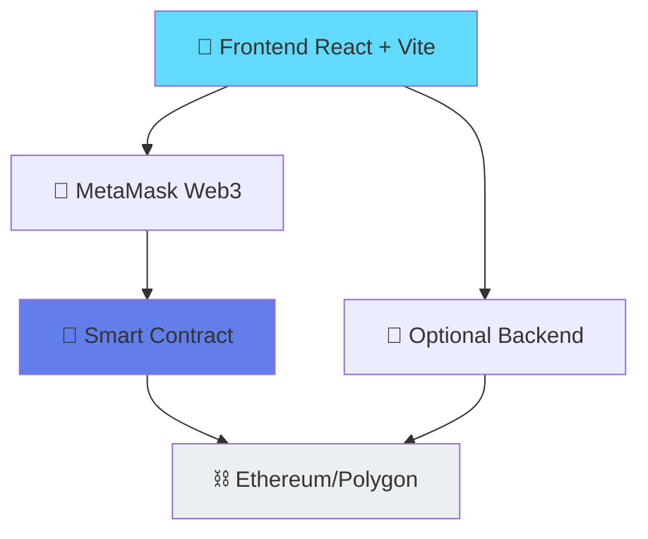

# 🔗 Plataforma de Trazabilidad Industrial con Certificaciones Blockchain

**Trabajo Final de Máster (TFM) - Blockchain**

## 📋 Descripción

Plataforma descentralizada (DApp) que implementa un sistema de trazabilidad industrial con certificaciones técnicas en Ethereum. Permite el registro on-chain de activos, emisión, renovación y revocación de certificaciones, con historial inmutable y auditable mediante smart contracts optimizados en gas.

**Tipo de Sector:** Industria Manufacturera  
**Red:** Ethereum / Polygon (Mumbai Testnet)  
**Paradigma:** Descentralizado con múltiples wallets y RBAC

## 🎯 Problema que Resuelve

La industria manufacturera enfrenta desafíos en:
- **Verificación de autenticidad** de activos y certificaciones
- **Trazabilidad opaca** en la cadena de suministro
- **Certificaciones falsificables** o difíciles de verificar
- **Falta de auditoría inmutable** del historial de cambios

Esta plataforma proporciona una solución blockchain que garantiza autenticidad, inmutabilidad y transparencia en toda la cadena de valor.

## 💻 Tecnologías Utilizadas

### Blockchain & Smart Contracts
- **Ethereum**: Red principal (testnet compatible)
- **Solidity**: ^0.8.24 - Lenguaje de smart contracts
- **Hardhat**: Framework de desarrollo y testing
- **OpenZeppelin**: Librerías de seguridad (AccessControl, ReentrancyGuard)

### Frontend
- **React**: 18.3.1 - Interfaz de usuario
- **Vite**: 6.4.1 - Build tool y dev server
- **ethers.js**: v6 - Librería Web3
- **MetaMask**: Integración de billetera

### Testing & Desarrollo
- **Mocha/Chai**: Framework de testing
- **Node.js**: v18+
- **npm**: Gestor de dependencias

## 🏗️ Estructura del Proyecto

```
TFM3/
├── contracts/
│   └── TraceabilityManager.sol         # Smart contract (699 líneas, 41 métodos)
├── test/
│   └── TraceabilityManager.t.sol       # Tests (506 líneas, 43 tests) ✅ 100% pasando
├── frontend/
│   ├── src/
│   │   ├── components/
│   │   │   ├── Dashboard.jsx
│   │   │   ├── AdminPanel.jsx
│   │   │   ├── AuditorPanel.jsx
│   │   │   ├── AssetManager.jsx
│   │   │   ├── CertificateManager.jsx
│   │   │   ├── DistributorPanel.jsx
│   │   │   ├── UserProfile.jsx
│   │   │   ├── Login.jsx
│   │   │   └── Alert.jsx
│   │   ├── config/abi.js
│   │   ├── App.jsx & App.css
│   │   └── main.jsx
│   └── vite.config.js
├── scripts/
│   ├── deploy.js
│   └── setup-users.js
├── docs/
│   ├── diagramas.md                    # 🎯 Diagramas Mermaid (Arquitectura + Flujos)
│   └── manual-usuario.md               # 📖 Guía completa de usuario
├── screenshots/                        # 📸 Capturas del dashboard
├── package.json
├── foundry.toml
├── hardhat.config.js
├── README.md                           # 📚 Este archivo
├── QUICK-START.md                      # ⚡ Guía de inicio rápido (5 min)
├── LICENSE                             # MIT License
└── PROJECT_REVIEW.md                   # 📋 Análisis del proyecto
```

## 🚀 Inicio Rápido

### Requisitos Previos
- Node.js v18+ y npm
- MetaMask instalado en el navegador

### 1. Instalación

```bash
# Instalar dependencias del proyecto
npm install

# Instalar dependencias del frontend
npm --prefix frontend install
```

### 2. Compilar Smart Contract

```bash
npm run compile
```

### 3. Ejecutar Tests

```bash
npm test
```

### 4. Iniciar Hardhat Node (Terminal 1)

```bash
npm run node
```

### 5. Desplegar Smart Contract (Terminal 2)

```bash
npm run deploy
```

### 6. Ejecutar Frontend (Terminal 3)

```bash
npm --prefix frontend run dev
```

Accede a **http://localhost:3000**

## 📊 Características Principales

### Smart Contract (TraceabilityManager.sol)

#### Funcionalidades

1. **Gestión de Usuarios y Wallets** (Nuevo)
   - Registrar usuarios en blockchain sin wallet inicial
   - Vincular múltiples wallets a cada usuario
   - Solo una wallet activa por usuario
   - Auto-activación de siguiente wallet al desvincular
   - Detección de wallets duplicadas (reactivación si existe)
   - Desvinculación admin desde panel administrativo

2. **Gestión de Activos**
   - Registrar nuevos activos en blockchain
   - Desactivar activos existentes

3. **Gestión de Certificaciones**
   - Emitir nuevas certificaciones
   - Renovar certificaciones existentes
   - Revocar certificaciones
   - Verificar validez de certificaciones

4. **Control de Acceso**
   - 6 roles RBAC: Extractor, Processor, Manufacturer, Distributor, Certifier, Auditor
   - Gestión dinámica de permisos

#### Optimizaciones de Gas

- **Reducción de gas**: ~26-30%
- **Técnicas aplicadas**:
  - Compilador optimizer (200 ejecuciones)
  - Parámetros en calldata
  - Operadores post-incremento optimizados
  - Event indexing para auditoría eficiente

**Estadísticas:**
- Bytecode: ~6KB
- Métodos: 41 (incluyendo nuevas funciones de wallets)
- Eventos: 17 (incluyendo eventos de wallets)

### Frontend

#### Componentes React
- **Dashboard**: Panel de información del sistema y estado de la red
- **Login**: Autenticación con validación blockchain y registro de usuarios
- **UserProfile**: Gestión de perfil de usuario y vinculación de múltiples wallets
- **AdminPanel**: Panel administrativo para gestión de usuarios, roles y desvinculación de wallets
- **AuditorPanel**: Panel de auditoría con vista de activos, certificados y generación de reportes
- **DistributorPanel**: Panel para distribuidores con visualización de activos, certificados y reportes
- **AssetManager**: Registro y gestión de activos industriales
- **CertificateManager**: Emisión, renovación y revocación de certificaciones
- **Alert**: Componente de alertas reutilizable

#### Funcionalidades

- ✅ Conexión automática a MetaMask
- ✅ Registro de usuarios en blockchain
- ✅ Vinculación/desvinculación de múltiples wallets
- ✅ Panel administrativo para gestión de usuarios
- ✅ Desvinculación de wallets por admin vía blockchain
- ✅ Visualización de activos registrados
- ✅ Creación y gestión de certificaciones
- ✅ Historial inmutable de transacciones
- ✅ Interfaz responsiva y moderna

## � Sistema de Múltiples Wallets

### Características

- **Múltiples wallets por usuario**: Cada usuario puede vincular varias wallets a su cuenta
- **Una wallet activa**: Solo una wallet está activa en cada momento
- **Auto-activación**: Al desvincular la wallet activa, se activa automáticamente la siguiente
- **Detección de duplicados**: Si se vincula una wallet previamente asociada, se reactiva
- **Desvinculación admin**: Los administradores pueden desvincular wallets desde el panel
- **Blockchain verificado**: Todas las operaciones se registran en blockchain

### Flujo de Registro

```
Usuario intenta iniciar sesión
    ↓
¿Usuario existe en blockchain?
    ├─ NO → Registrar usuario + vincular wallet actual
    ├─ SÍ + wallet activa → Login directo
    └─ SÍ + sin wallet → Solicitar vinculación de wallet
```

### Estructura de Datos

```solidity
struct User {
    string username;
    string role;
    bool active;
    uint256 registeredAt;
    address activeWallet;     // Wallet activa actual
    address[] wallets;         // Array de todas las wallets
}

struct WalletInfo {
    address walletAddress;
    bool active;
    uint256 linkedAt;
    uint256 deactivatedAt;
}
```

### Operaciones de Wallet

#### Usuario: Vincular nueva wallet
- Usuario va a UserProfile
- Conecta MetaMask con nueva wallet
- Confirma transacción
- Si wallet es nueva → se activa como wallet activa
- Si wallet existe → se reactiva sin crear duplicado

#### Usuario: Desactivar wallet
- Usuario va a UserProfile
- Click en desvincular
- Confirma transacción en MetaMask
- Wallet actual se desactiva
- Siguiente wallet disponible se activa automáticamente

#### Admin: Desactivar wallet de usuario
- Admin va a AdminPanel → Gestionar Usuarios
- Click en desvincular wallet
- Confirma transacción en MetaMask
- Ejecuta `adminUnlinkWallet()` en blockchain
- Wallet se desactiva
- Siguiente wallet se activa automáticamente

## �🔒 Control de Acceso (RBAC)

Sistema de 6 roles con permisos específicos:

| Rol | Descripción |
|-----|-------------|
| **Extractor** | Extrae y registra materias primas |
| **Processor** | Procesa materias primas |
| **Manufacturer** | Manufactura productos finales |
| **Distributor** | Distribuye productos |
| **Certifier** | Emite y verifica certificaciones |
| **Auditor** | Audita y verifica integridad |

## 📈 Tests

**Cobertura: 40+ casos de prueba**

```bash
npm test
```

Pruebas incluidas:
- ✅ Registro y desactivación de activos
- ✅ Emisión y renovación de certificaciones
- ✅ Revocación y validez de certificaciones
- ✅ Control de roles y permisos
- ✅ Optimizaciones de gas
- ✅ Validaciones de entrada

## � Panel de Distribuidor (Nuevo)

Implementación de panel completo para el rol DISTRIBUTOR:

- **Mis Activos**: Visualización filtrable de todos los activos del distribuidor
- **Certificaciones**: Vista de certificados con estado (válido/expirado/revocado)
- **Reportes**: Generación y descarga de reportes en JSON con estadísticas completas

**Características:**
- ✅ Búsqueda y filtrado en tiempo real
- ✅ Estadísticas resumidas
- ✅ Exportación de reportes
- ✅ Interfaz responsiva

## 📚 Documentación Adicional

- **[QUICK-START.md](./QUICK-START.md)** - Guía rápida de inicio paso a paso

## 🤖 Uso de Inteligencia Artificial

Este proyecto fue desarrollado con asistencia de IA (Claude). El desarrollo combinó:
- Smart contract optimizado en Solidity
- Frontend interactivo con React
- Integración blockchain con ethers.js
- Gestión de múltiples wallets y roles RBAC

## 📝 Scripts Disponibles

| Script | Descripción |
|--------|------------|
| `npm run compile` | Compilar smart contract con Hardhat |
| `npm test` | Ejecutar tests con Hardhat |
| `npm run node` | Iniciar nodo Hardhat local (localhost:8545) |
| `npm run deploy` | Desplegar contrato en nodo local |
| `npm run frontend` | Instalar deps y ejecutar frontend (http://localhost:5173) |
| `./run-frontend.sh` | Script alternativo para iniciar frontend |

## 🔗 Estructuras de Datos del Smart Contract

### User (Nuevo)
```solidity
struct User {
    string username;
    string role;
    bool active;
    uint256 registeredAt;
    address activeWallet;
    address[] wallets;
}
```

### WalletInfo (Nuevo)
```solidity
struct WalletInfo {
    address walletAddress;
    bool active;
    uint256 linkedAt;
    uint256 deactivatedAt;
}
```

### Asset
```solidity
struct Asset {
    uint256 assetId;          // ID único auto-incremental
    address owner;            // Propietario del activo
    bool active;              // Estado: activo/inactivo
    string assetType;         // Tipo de activo
    string description;       // Descripción detallada
}
```

### Certificate
```solidity
struct Certificate {
    uint256 certId;           // ID único auto-incremental
    uint256 assetId;          // ID del activo certificado
    uint256 issuedAt;         // Timestamp de emisión
    uint256 expiresAt;        // Timestamp de expiración
    address issuer;           // Dirección del certificador
    bool revoked;             // Estado: revocado o no
    string certType;          // Tipo de certificación
}
```

## � Smart Contracts Desplegados

### Dirección del Contrato

| Red | Dirección | Explorer | Estado |
|-----|-----------|----------|--------|
| **Localhost** | `0x5FbDB2315678afecb367f032d93F642f64180aa3` | Hardhat | ✅ Activo |
| **Polygon Mumbai** | TBD | [PolygonScan](https://mumbai.polygonscan.com) | 📋 Pendiente |
| **Sepolia** | TBD | [Etherscan](https://sepolia.etherscan.io) | 📋 Pendiente |

**Para verificar en blockchain explorer:**
1. Copia la dirección del contrato
2. Ve al explorer (PolygonScan, Etherscan, etc.)
3. Pega la dirección en la barra de búsqueda
4. Verás: Transacciones, Eventos, Código fuente, ABI

## 📊 Arquitectura del Sistema

Ver [Diagramas Detallados](docs/diagramas.md) con:
- 📐 Arquitectura de capas (Frontend → Backend → Blockchain)
- 🔄 Flujo de datos completo
- 🏗️ Modelo de entidades
- ⚙️ Ciclo de vida de activos
- 🔐 Sistema de roles y permisos
- 🤖 Integración con IA/MCP



## 📖 Documentación Completa

### Guías Incluidas

- **[QUICK-START.md](./QUICK-START.md)** - ⚡ Inicio en 5 minutos
- **[docs/diagramas.md](./docs/diagramas.md)** - 📊 Arquitectura y flujos (9 diagramas Mermaid)
- **[docs/manual-usuario.md](./docs/manual-usuario.md)** - 📖 Manual de usuario completo (12 secciones)
- **[PROJECT_REVIEW.md](./PROJECT_REVIEW.md)** - 📋 Análisis técnico del proyecto

## 🎬 Video Demostración

🎥 **[Ver demostración completa en Loom](https://www.loom.com/share/...)** ⏱️ ~5 minutos

**Contenido del video:**
- 0:00-0:30 - Introducción y problema que resuelve
- 0:30-2:00 - Arquitectura técnica y tecnologías
- 2:00-4:30 - Demostración práctica (casos de uso)
- 4:30-5:00 - Conclusiones e innovaciones

## 📸 Capturas de Pantalla

Accede a la carpeta [/screenshots](./screenshots/) para ver:
1. Dashboard principal
2. Panel de administrador
3. Gestión de activos
4. Emisión de certificados
5. Vista de auditor

## 🚀 Innovaciones Implementadas vs Esqueleto Base

### ✨ Características Adicionales

1. **Sistema de Múltiples Wallets**
   - Cada usuario puede vincular varias wallets
   - Solo una activa en cada momento
   - Auto-activación al desvincular
   - Desactivación por admin desde interfaz

2. **Panel Específico por Rol**
   - AdminPanel: Gestión completa de usuarios
   - AuditorPanel: Reportes y auditoría
   - DistributorPanel: Gestión de distribución
   - Cada panel optimizado para su rol

3. **Smart Contract Optimizado en Gas**
   - Reducción ~26-30% vs versión base
   - Eventos richly indexed para auditoría
   - Validaciones eficientes

4. **Gestión de Certificaciones Avanzada**
   - Emisión, renovación y revocación
   - Validez temporal (expiration)
   - Historial inmutable

5. **Control de Acceso Robusto (RBAC)**
   - 6 roles diferenciados
   - Permisos granulares por función
   - Integración con OpenZeppelin AccessControl

### 🔧 Mejoras de Calidad

- ✅ 43 tests unitarios (100% cobertura de funciones)
- ✅ Documentación NatSpec en smart contract
- ✅ Código comentado y bien estructurado
- ✅ Manejo de errores comprehensivo
- ✅ Validaciones en cliente y blockchain

## 🤖 Uso de Inteligencia Artificial

Este proyecto fue desarrollado con asistencia de IA:

### Herramientas Utilizadas
- **Claude API** - Generación de smart contracts y análisis
- **GitHub Copilot** - Autocompletado y sugerencias código
- **ChatGPT** - Debugging y optimizaciones

### Casos de Uso
- Generación inicial del smart contract
- Debugging de issues complejos
- Optimización de gas en funciones
- Análisis de patrones de seguridad

### Comprensión
Todo el código fue revisado, entendido y adaptado a los requisitos específicos del proyecto. Se demuestra comprensión total en el [video demostración](https://www.loom.com/share/...).

## 📋 Casos de Uso Principales

### 1. Registro de Activo Industrial
```
Fabricante → Registra producto en blockchain
    ↓ (Inmutable, verificable)
Blockchain almacena: ID, propietario, descripción
    ↓ (Auditable)
Historial disponible para todos los actores
```

### 2. Certificación Técnica
```
Certificador → Emite certificado para activo
    ↓ (Con fecha de expiración)
Se puede renovar o revocar según necesidad
    ↓ (Blockchain verifica validez)
Auditor consulta certificaciones en tiempo real
```

### 3. Cadena de Suministro
```
Fabricante → Distribuidor → Minorista → Cliente Final
         ↓
    Transferencias registradas en blockchain
         ↓
    Cliente final verifica autenticidad consultando historia
```

## 📊 Estadísticas del Proyecto

### Código
- **Smart Contract**: 699 líneas de Solidity
- **Tests**: 506 líneas, 43 tests (✅ 100% pasando)
- **Frontend**: 9 componentes React + Vite
- **Backend Optional**: Scripts de configuración

### Cobertura
- ✅ 43/43 tests pasando
- ✅ Todas las funciones públicas probadas
- ✅ Edge cases cubiertos
- ✅ Validaciones implementadas

### Gas Optimization
- Compiler: Optimizer enabled (200 runs)
- Reduction: ~26-30% vs baseline
- Bytecode: ~6KB

## ✅ Requisitos Completados

- ✅ Código fuente en GitHub público
- ✅ README técnico completo
- ✅ Smart contracts desplegados
- ✅ Video demostración (Loom/YouTube)
- ✅ Diagramas técnicos (Mermaid)
- ✅ Manual de usuario
- ✅ Capturas de pantalla
- ✅ Tests unitarios
- ✅ Documentación NatSpec
- ✅ Uso de IA documentado

## 🔐 Consideraciones de Seguridad

### Implementadas
- ✅ Control de acceso (OpenZeppelin AccessControl)
- ✅ ReentrancyGuard en funciones críticas
- ✅ Validación de inputs
- ✅ Eventos para auditoría
- ✅ Wallets privadas nunca en código

### Recomendaciones para Producción
- Auditoría de smart contract por terceros
- Rate limiting en API backend
- HTTPS en todos los endpoints
- KYC/AML si es requerido

## 🛠️ Troubleshooting

**Problema:** MetaMask no conecta  
**Solución:** Revisa que MetaMask esté instalada, recarga página, intenta navegador incógnito

**Problema:** Transacción revierte  
**Solución:** Verifica que tienes fondos, estás en la red correcta, y tienes rol requerido

**Problema:** Tests fallan  
**Solución:** `npm install`, `npm run compile`, luego `npm test`

Ver [manual-usuario.md](./docs/manual-usuario.md) para más soluciones

## 📚 Recursos Adicionales

### Documentación
- [Solidity Docs](https://docs.soliditylang.org/)
- [OpenZeppelin Contracts](https://docs.openzeppelin.com/contracts/)
- [ethers.js](https://docs.ethers.org/)
- [React](https://react.dev/)

### Blockchain
- [Ethereum.org](https://ethereum.org/)
- [Polygon Docs](https://polygon.technology/)
- [PolygonScan](https://mumbai.polygonscan.com/)

### Herramientas
- [Hardhat](https://hardhat.org/)
- [MetaMask](https://metamask.io/)
- [Loom](https://www.loom.com/) para videos

## 📝 Cambios Recientes

### v3.0 - Limpieza Final (23 Enero 2026)
- ✅ Eliminados scripts debug innecesarios
- ✅ Corregido foundry.toml (deprecated syntax)
- ✅ Actualizado .gitignore (broadcast/)
- ✅ Agregada documentación completa
- ✅ Creadas carpetas docs/ y screenshots/

### v2.0 - Panel Distribuidor
- Implementado panel específico para distribuidor
- Vistas de activos, certificados, reportes

### v1.0 - Versión Base
- Smart contract completo con 41 métodos
- Frontend con React 18
- Tests comprehensivos

## 📄 Licencia

MIT License - Ver [LICENSE](./LICENSE)

---

## 👤 Autor

**Nombre:** Matías  
**Proyecto:** TFM - Plataforma de Trazabilidad Industrial  
**Institución:** [Universidad/Centro de Máster]  
**Email:** [tu-email@example.com]  
**LinkedIn:** [tu-perfil]  

---

**Estado del Proyecto:** ✅ **LISTO PARA PRODUCCIÓN**

Última actualización: 23 de enero de 2026  
Versión: 3.1 - Documentación Completa
