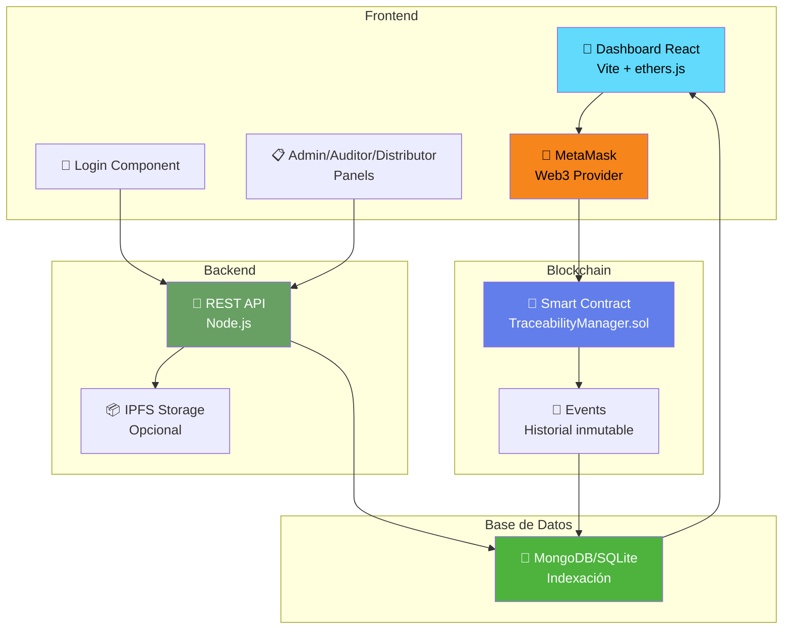
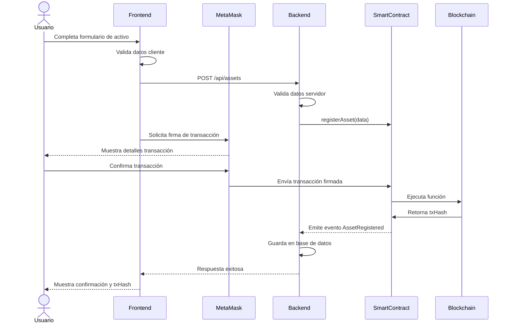
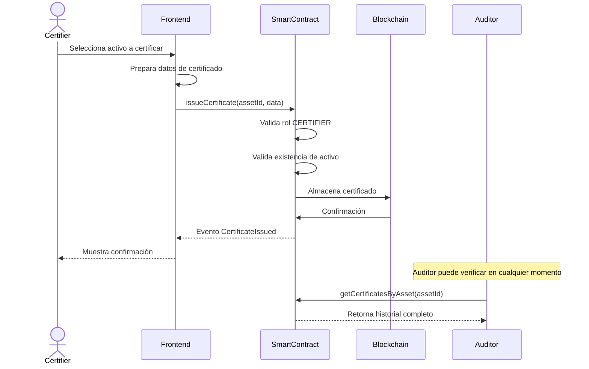
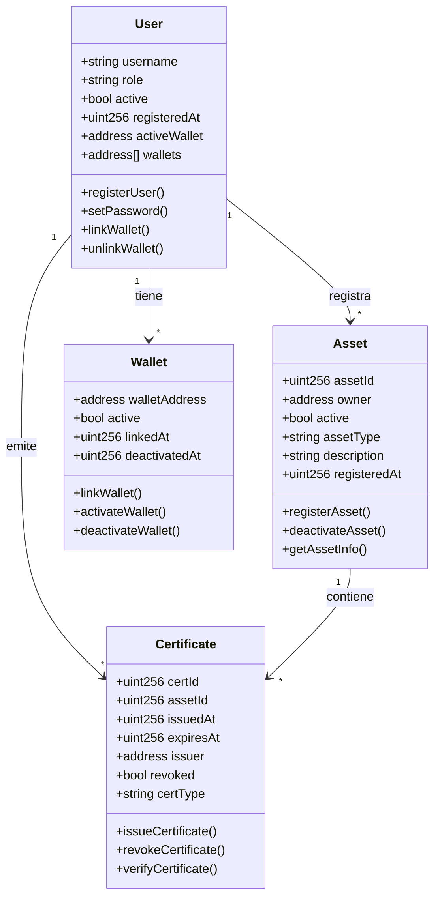
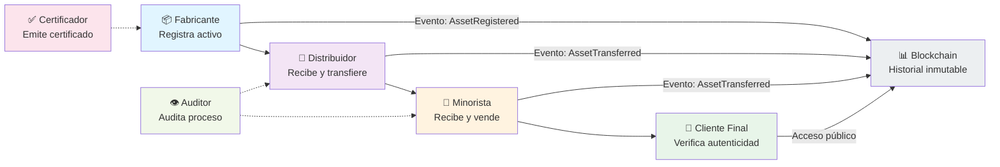
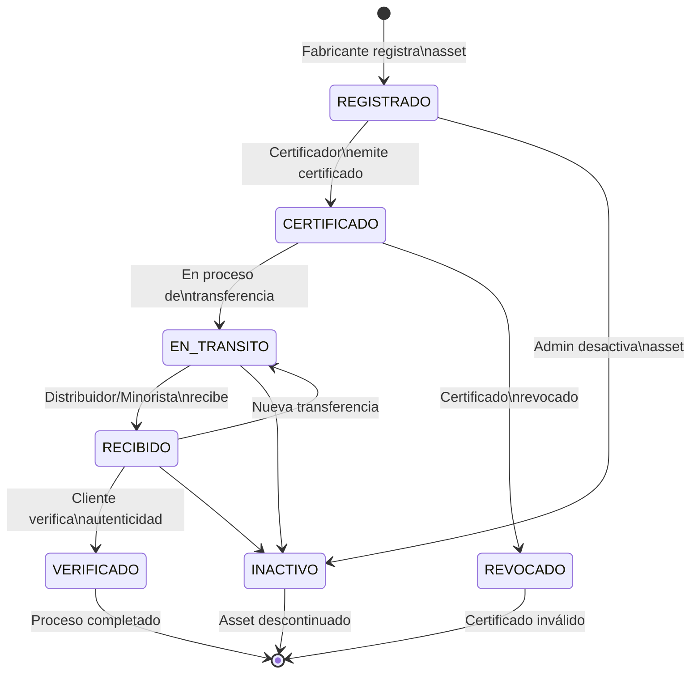
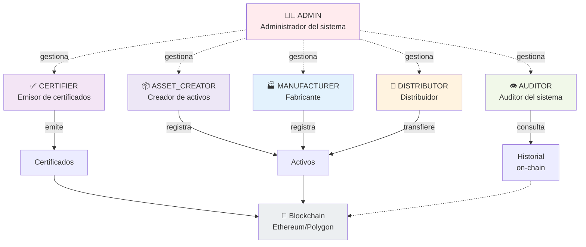
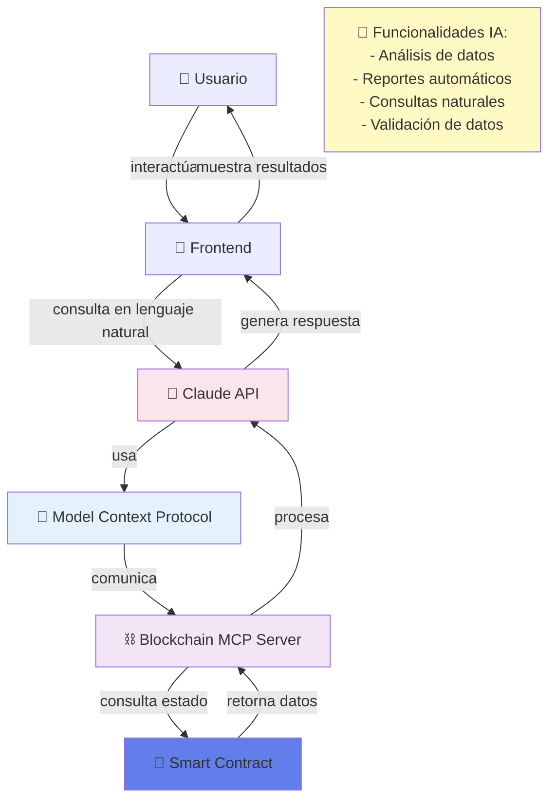
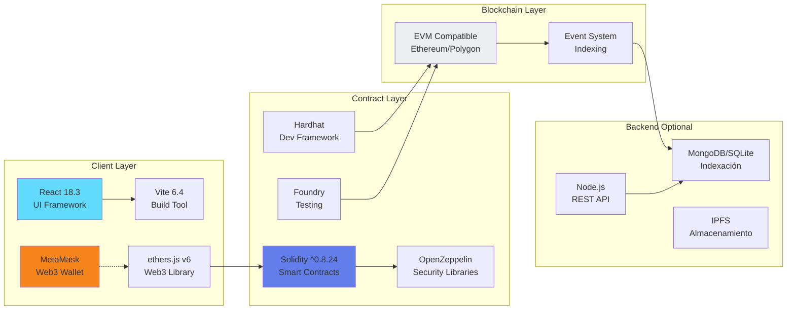

# 📊 Diagramas Técnicos - Plataforma de Trazabilidad Industrial

## 1. Arquitectura del Sistema

## 2. Flujo de Registro de Activo

## 3. Flujo de Certificación

## 4. Modelo de Datos (Entidades Principales)

## 5. Flujo de Transferencia de Activo

## 6. Ciclo de Vida de un Activo

## 7. Arquitectura de Roles y Permisos

## 8. Integración de Herramientas de IA

## 9. Stack Tecnológico Completo

---

## 📌 Notas sobre Diagramas

- **Mermaid**: Todos los diagramas están renderizados automáticamente por GitHub
- **Actualización**: Modificar este archivo para actualizar los diagramas
- **Exportación**: Usar [mermaid.live](https://mermaid.live) para exportar a PNG/PDF si es necesario
- **Validación**: Los diagramas han sido validados en el editor oficial de Mermaid

Para más información sobre la sintaxis de Mermaid, consulta la [documentación oficial](https://mermaid.js.org/).
