# 📊 Diagramas Técnicos - Plataforma de Trazabilidad Industrial

## 1. Arquitectura del Sistema

```mermaid
graph TB
    subgraph "Frontend"
        UI["🎨 Dashboard React<br/>Vite + ethers.js"]
        LOGIN["🔐 Login Component"]
        PANELS["📋 Admin/Auditor/Distributor<br/>Panels"]
        METAMASK["🦊 MetaMask<br/>Web3 Provider"]
    end

    subgraph "Backend"
        API["🔄 REST API<br/>Node.js"]
        IPFS["📦 IPFS Storage<br/>Opcional"]
    end

    subgraph "Blockchain"
        SC["📜 Smart Contract<br/>TraceabilityManager.sol"]
        EVENTS["📡 Events<br/>Historial inmutable"]
    end

    subgraph "Base de Datos"
        DB["💾 MongoDB/SQLite<br/>Indexación"]
    end

    UI --> METAMASK
    LOGIN --> API
    PANELS --> API
    METAMASK --> SC
    API --> DB
    API --> IPFS
    SC --> EVENTS
    DB --> UI
    EVENTS --> DB

    style UI fill:#61dafb,color:#000
    style API fill:#68a063,color:#fff
    style SC fill:#627eea,color:#fff
    style DB fill:#4db33d,color:#fff
    style METAMASK fill:#f6851b,color:#000
```

## 2. Flujo de Registro de Activo

```mermaid
sequenceDiagram
    actor Usuario
    participant Frontend
    participant MetaMask
    participant Backend
    participant SmartContract
    participant Blockchain

    Usuario->>Frontend: Completa formulario de activo
    Frontend->>Frontend: Valida datos cliente
    Frontend->>Backend: POST /api/assets
    Backend->>Backend: Valida datos servidor
    Backend->>SmartContract: registerAsset(data)
    Frontend->>MetaMask: Solicita firma de transacción
    MetaMask-->>Usuario: Muestra detalles transacción
    Usuario->>MetaMask: Confirma transacción
    MetaMask->>SmartContract: Envía transacción firmada
    SmartContract->>Blockchain: Ejecuta función
    Blockchain->>SmartContract: Retorna txHash
    SmartContract-->>Backend: Emite evento AssetRegistered
    Backend->>Backend: Guarda en base de datos
    Backend-->>Frontend: Respuesta exitosa
    Frontend-->>Usuario: Muestra confirmación y txHash
```

## 3. Flujo de Certificación

## 4. Modelo de Datos (Entidades Principales)

## 5. Flujo de Transferencia de Activo

```mermaid
graph LR
    A["📦 Fabricante<br/>Registra activo"] --> B["🚚 Distribuidor<br/>Recibe y transfiere"]
    B --> C["🏪 Minorista<br/>Recibe y vende"]
    C --> D["👤 Cliente Final<br/>Verifica autenticidad"]
    
    E["✅ Certificador<br/>Emite certificado"] -.-> A
    F["👁️ Auditor<br/>Audita proceso"] -.-> B
    F -.-> C
    
    A -->|Evento: AssetRegistered| G["📊 Blockchain<br/>Historial inmutable"]
    B -->|Evento: AssetTransferred| G
    C -->|Evento: AssetTransferred| G
    D -->|Acceso público| G
    
    style A fill:#e1f5ff
    style B fill:#f3e5f5
    style C fill:#fff3e0
    style D fill:#e8f5e9
    style E fill:#fce4ec
    style F fill:#f1f8e9
    style G fill:#eceff1
```

## 6. Ciclo de Vida de un Activo

## 7. Arquitectura de Roles y Permisos

```mermaid
graph TB
    ADMIN["👨‍💼 ADMIN<br/>Administrador del sistema"]
    CERTIFIER["✅ CERTIFIER<br/>Emisor de certificados"]
    MANUFACTURER["🏭 MANUFACTURER<br/>Fabricante"]
    DISTRIBUTOR["🚚 DISTRIBUTOR<br/>Distribuidor"]
    AUDITOR["👁️ AUDITOR<br/>Auditor del sistema"]
    ASSET_CREATOR["📦 ASSET_CREATOR<br/>Creador de activos"]
    
    ADMIN -.->|gestiona| CERTIFIER
    ADMIN -.->|gestiona| MANUFACTURER
    ADMIN -.->|gestiona| DISTRIBUTOR
    ADMIN -.->|gestiona| AUDITOR
    ADMIN -.->|gestiona| ASSET_CREATOR
    
    CERTIFIER -->|emite| CERT["Certificados"]
    ASSET_CREATOR -->|registra| ASSET["Activos"]
    MANUFACTURER -->|registra| ASSET
    DISTRIBUTOR -->|transfiere| ASSET
    AUDITOR -->|consulta| HIST["Historial<br/>on-chain"]
    
    CERT --> BLOCKCHAIN["🔗 Blockchain<br/>Ethereum/Polygon"]
    ASSET --> BLOCKCHAIN
    HIST -.-> BLOCKCHAIN
    
    style ADMIN fill:#ffebee
    style CERTIFIER fill:#f3e5f5
    style MANUFACTURER fill:#e3f2fd
    style DISTRIBUTOR fill:#fff3e0
    style AUDITOR fill:#f1f8e9
    style ASSET_CREATOR fill:#ede7f6
    style BLOCKCHAIN fill:#eceff1
```

## 8. Integración de Herramientas de IA

```mermaid
graph TB
    USER["👤 Usuario"]
    FRONTEND["🎨 Frontend"]
    CLAUDE["🤖 Claude API"]
    MCP["🔌 Model Context Protocol"]
    BLOCKCHAIN_MCP["⛓️ Blockchain MCP Server"]
    SC["📜 Smart Contract"]
    
    USER -->|interactúa| FRONTEND
    FRONTEND -->|consulta en lenguaje natural| CLAUDE
    CLAUDE -->|usa| MCP
    MCP -->|comunica| BLOCKCHAIN_MCP
    BLOCKCHAIN_MCP -->|consulta estado| SC
    SC -->|retorna datos| BLOCKCHAIN_MCP
    BLOCKCHAIN_MCP -->|procesa| CLAUDE
    CLAUDE -->|genera respuesta| FRONTEND
    FRONTEND -->|muestra resultados| USER
    
    NOTE["📝 Funcionalidades IA:<br/>- Análisis de datos<br/>- Reportes automáticos<br/>- Consultas naturales<br/>- Validación de datos"]
    
    style CLAUDE fill:#fce4ec
    style MCP fill:#e3f2fd
    style BLOCKCHAIN_MCP fill:#f3e5f5
    style SC fill:#627eea
    style NOTE fill:#fff9c4
```

## 9. Stack Tecnológico Completo

---

## 📌 Notas sobre Diagramas

- **Mermaid**: Todos los diagramas están renderizados automáticamente por GitHub
- **Actualización**: Modificar este archivo para actualizar los diagramas
- **Exportación**: Usar [mermaid.live](https://mermaid.live) para exportar a PNG/PDF si es necesario
- **Validación**: Los diagramas han sido validados en el editor oficial de Mermaid

Para más información sobre la sintaxis de Mermaid, consulta la [documentación oficial](https://mermaid.js.org/).
